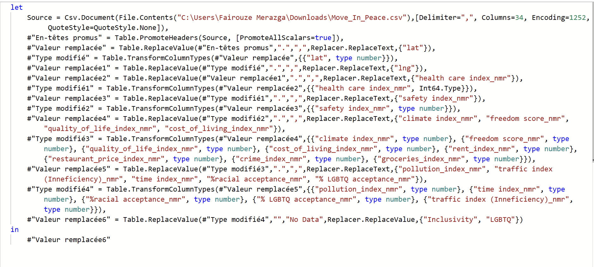
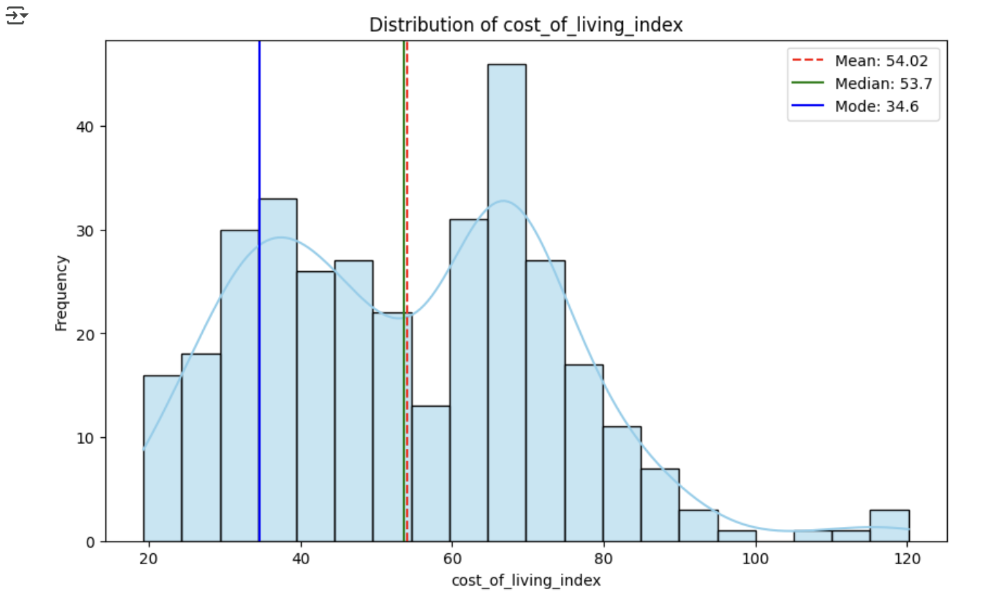
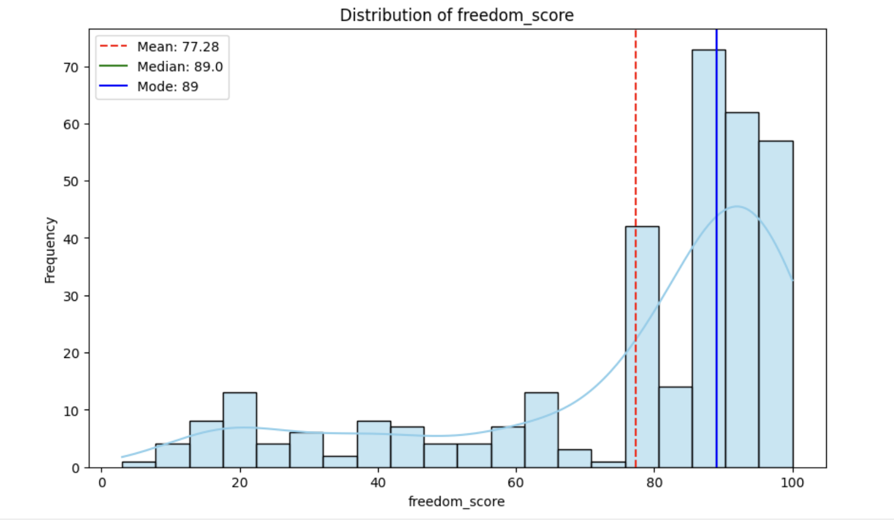
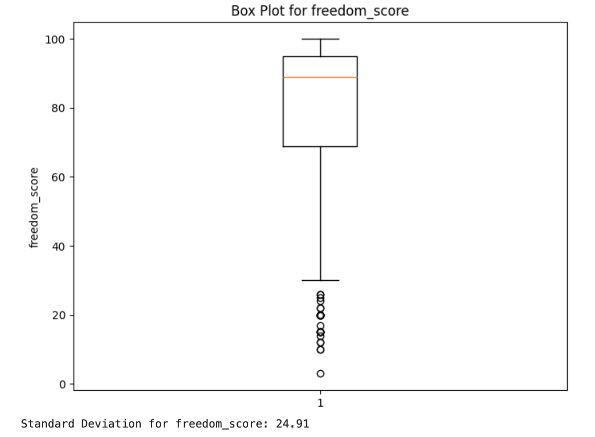
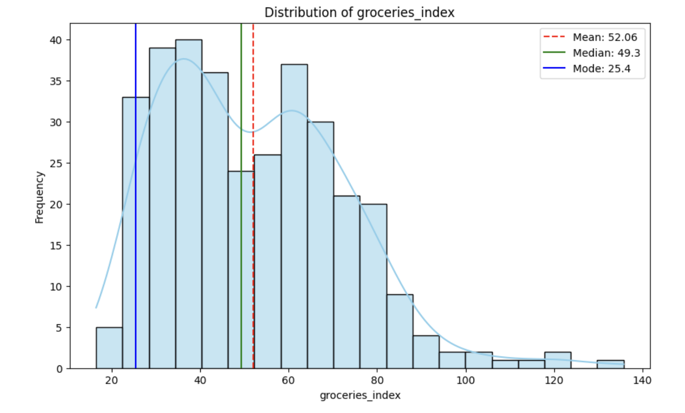
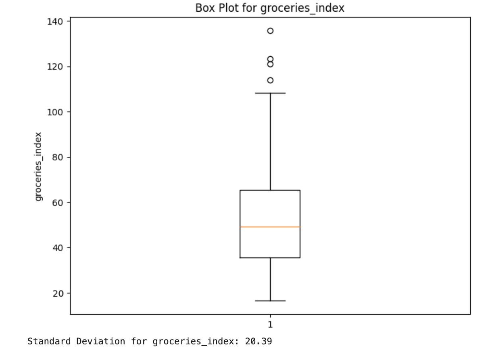
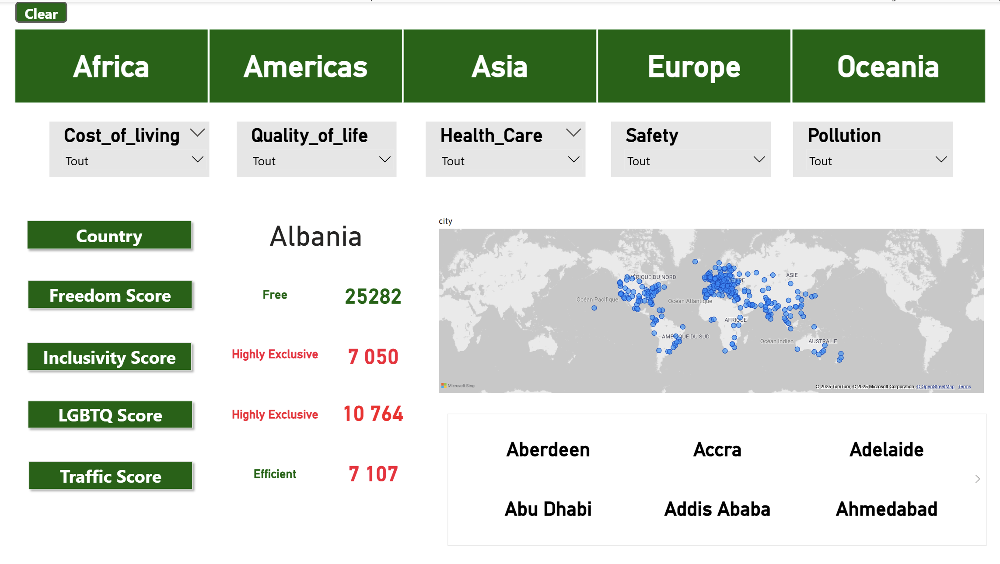

  

## I. Introduction

### **Who is CitySpot?**

CitySpot is a data analysis project developed as part of my portfolio as a Junior Data Analyst. The goal of CitySpot is to help individuals – whether they are digit

## I. Introduction

### **Who is CitySpot?**

CitySpot is a data analysis project developed as part of my portfolio as a Junior Data Analyst. The goal of CitySpot is to help individuals – whether they are digital nomads, students, content creators, expatriate professionals, or families – identify the destination that best matches their preferences and priorities.

CitySpot positions itself as an interactive, data-driven decision-making tool. It relies on a rigorous analytical methodology to transform raw data into actionable insights and intuitive visualizations, making the process of choosing a place to live easier and more informed.

### **Project Goal**

The main objectives of this project are to:

- **Collect and structure** socio-economic, cultural, and environmental data from reliable sources.
- **Analyze and compare** different destinations based on key criteria (cost of living, safety, healthcare, education, social inclusion, environment).
- **Develop an interactive dashboard** in Power BI that allows users to visualize trends, compare cities, and receive personalized recommendations.

This project also aims to showcase my skills in **data cleaning**, **exploratory data analysis (EDA)**, **modeling (clustering, classification)**, and **visualization**, resulting in a concrete and professional deliverable.

### **Dataset**

The datasets used in this project come from multiple reliable and open sources, including:

- **Numbeo** – cost of living, crime rates, healthcare indices.
- **Equaldex** – social inclusion and LGBTQ+ rights data.
- **Freedom House** – political freedom and human rights indicators.
- **World Population Review** – demographic and quality-of-life data.
- **European & World Values Studies** – societal and cultural values.
- **Simple Maps** – geographic information for cities.

These datasets were collected, cleaned, and combined to create a unified database, allowing for a multi-criteria analysis of cities worldwide.

| **Column Name** | **Description** |
| --- | --- |
| **Index** | Unique identifier for each row. |
| **City** | Name of the city being analyzed. |
| **Country** | Country where the city is located. |
| **Region** | Larger geographical region (e.g., Europe, Americas). |
| **Sub-region** | More specific geographical area within the region (e.g., Western Europe, North America). |
| **Cost of Living Index** | Numerical index representing the cost of living in the city (higher = more expensive). |
| **Rent Index** | Index measuring housing and rental prices (higher = more expensive). |
| **Groceries Index** | Index comparing grocery prices in the city (higher = more expensive). |
| **Restaurant Price Index** | Index comparing restaurant and dining prices (higher = more expensive). |
| **Local Purchasing Power Index** | Index representing residents' purchasing power relative to other cities (higher = stronger purchasing power). |
| **Quality of Life Index** | Composite score summarizing overall quality of life, including safety, cost of living, healthcare, and infrastructure. |
| **Health Care Index** | Index measuring the quality and accessibility of healthcare services (higher = better healthcare). |
| **Crime Index** | Index representing the level of crime in the city (higher = more crime). |
| **Pollution Index** | Index measuring air, water, and environmental pollution (higher = more pollution). |
| **Traffic Index (Inefficiency)** | Index evaluating traffic congestion and inefficiency (higher = worse traffic). |
| **Safety Index** | Index measuring how safe the city is (higher = safer). |
| **Affordability Index** | Indicator combining cost of living, rent, and purchasing power to show overall affordability (higher = more affordable). |
| **Climate Index** | Index describing how comfortable and pleasant the local climate is (higher = better climate). |
| **Time Index (in minutes)** | Average commute time or time lost due to traffic congestion (higher = longer commutes). |
| **% Racial Acceptance** | Percentage indicating the level of racial and ethnic diversity acceptance in the city. |
| **% LGBTQ Acceptance** | Percentage indicating acceptance and inclusivity toward LGBTQ+ individuals. |
| **Freedom Score** | Score measuring political freedom, civil liberties, and human rights (higher = more free). |
| **lat** | Latitude of the city (geographical coordinate). |
| **lng** | Longitude of the city (geographical coordinate). |
| **Population** | Estimated population of the city. |

### **Tools Used**

- **Google Colab (Python)**
    - Data cleaning and preparation.
    - Exploratory Data Analysis (EDA): descriptive statistics, correlations, and visualizations (Matplotlib / Seaborn).
    - Modeling: clustering (K-Means) and classification.
      
- **Excel**
    - Initial data inspection and structuring.
    - Simple calculations and quality checks.
      
- **Power Query**
    - Advanced data transformation and preparation before integration.
      
- **Power BI**
    - Development of an interactive dashboard.
    - Visualization of key indicators and personalized recommendations.

## II. Data Exploration

This section describes the **data exploration and validation** performed on the merged Numbeo dataset, structured in six steps.

<strong>STEP 1 – Identify All Sources / Tables</strong>

**Objective:** Understand the overall dataset structure and sources.

- Sources identified:
  - `NUMBEO_COST_OF_LIVING`
  - `NUMBEO_QUALITY_OF_LIFE`
  - `NUMBEO_CRIME_SAFETY`
  - `NUMBEO_HEALTH_CARE`
  - `NUMBEO_POLLUTION`
  - `NUMBEO_TRAFFIC`
  - `NUMBEO_AFFORDABILITY`
- Checked key columns and consistency (`City`, `Country`)

**Key insight:**
- All sources can be merged on the `City` column to create a complete dataset

<strong>STEP 2 – Explore Individual Datasets</strong>

**Objective:** Inspect each dataset to understand structure, size, and sample content.

- Actions performed:
  - Previewed first rows of each dataset
  - Counted total rows and columns
  - Checked key columns for consistency

**Observations:**
- Some columns contain missing values (e.g., `Pollution Index`, `Traffic Index`)
- Some numeric columns are stored as strings and need type conversion

<strong>STEP 3 – Define Keys and Merge Strategy</strong>

**Objective:** Ensure data integrity and define merging strategy.

- **Primary key for merging:** `City`
- **Secondary key (optional):** `Country`
- Merge strategy: `outer join` to retain all cities and all indicators

<strong>STEP 4 – Identify Relationships and Dependencies</strong>

**Objective:** Understand relationships between different Numbeo sources.

- All datasets share `City` → base for merging
- Each dataset provides a different type of score:
  - Quality of life
  - Cost
  - Safety
  - Pollution
  - Traffic
  - Health care
  - Affordability

**Key insight:**
- Merging enables analysis of correlations between living conditions, costs, and safety indicators for each city

<strong>STEP 5 – Column Characteristics and Data Quality</strong>

**Objective:** Examine columns for types, lengths, and potential issues.

- **Data types:** Conversion needed for numeric columns stored as strings → float/int
- **Text columns:** Standardized city and country names (`lowercase`, underscores)
- **Critical columns:** `City`, `Country` → no missing values

<strong>STEP 6 – Missing Values, Duplicates and Outliers (Details)</strong>

- **A. Missing Values Analysis**
  - Some columns have high missing percentages, e.g., `Traffic Index` or `Health Care Index`
  - **Decision:** retain columns with mostly available data, impute or ignore missing values depending on analysis needs

- **B. Duplicate Detection**
  - Checked for duplicated rows on `City` and `Country`
  - **Result:** no critical duplicates found

- **C. Outliers**
  - Checked numeric Numbeo scores for out-of-range values
  - **Result:** no major anomalies detected

- **D. Standardization and Cleaning**
  - Column names converted to lowercase and underscores
  - Numeric columns converted to float for statistical analysis

## III. Data Cleaning

<strong>STEP 1 – Standardize Column Names</strong>

- Column names were standardized by:
  - Converting all letters to lowercase
  - Replacing spaces with underscores  
- **Example:** `Cost of Living Index` → `cost_of_living_index`

<strong>STEP 2 – Convert Data Types</strong>

- Numeric columns stored as strings were converted to appropriate numeric types (`float` or `Int64`) for statistical analysis.
- Columns processed included:
  - `Population`
  - `%racial_acceptance`
  - `%_lgbtq_acceptance`
  - `Freedom Score`
  - Numbeo indices (`Cost of Living Index`, `Health Care Index`, etc.)

<strong>STEP 3 – Remove Duplicate Rows</strong>

- Duplicates were detected based on `City` and `Country`
- Removed duplicates while keeping the last occurrence
- Post-removal checks confirmed no duplicates remained

<strong>STEP 4 – Handle Missing Values</strong>

- Missing values were analyzed by row and column
- Rows with ≥20% missing values were removed, reducing the dataset to 333 rows
- Columns with high percentages of missing values were evaluated for retention or deletion

<strong>STEP 5 – Remove Unnecessary Columns</strong>

- Columns not essential for analysis were removed
- Example: `affordability_index` removed to simplify the dataset

<strong>STEP 6 – Verify Cleaning</strong>

- The dataset was checked to ensure it was ready for EDA:
  - Verification of column types
  - Confirmation of no remaining duplicates
  - Control of missing value percentages per column
  - Ensuring critical columns (`City`, `Country`) are complete and consistent

<strong>STEP 7 – Power Query Cleaning</strong>

  

- After exporting to Power Query, additional cleaning steps included:
  - Promotion of headers for correct column names
  - Replacement of problematic characters (`.` → `,`) in numeric columns
  - Conversion of numeric columns to appropriate types (`number` or `Int64`)
  - Replacement of empty strings with `No Data` in select columns  

The final dataset was fully cleaned and structured, ready for analysis and visualization in Power BI or SQL.

## IV. Exploratory Data Analysis (EDA)

### **1. Univariate Analysis**
    
**Purpose:** Understand the distribution and dispersion of each index.
    
- Visualized distributions of key indices to detect outliers and variability.
- Normalized all indices to place variables on a consistent scale for comparison.

<strong>A - Cost of Living Index</strong>

<table>
  <tr>
    <td>
      
      
<i>Cost of Living Index</i>

    </td>
    <td>
      
      
<i>Cost of Living Box Plot</i>

    </td>
  </tr>
</table>

**Insights**  
- **Two-peak distribution:** Two distinct peaks around 35 and 65, suggesting two city groups  
- **Mean (54.02) > Median (53.7):** Slightly right-skewed distribution  
- **High standard deviation (19.71):** Large variability in cost of living across cities  
- **Outliers present:** Few cities with extremely high living costs (>100)  
- **Natural segmentation:** Clear distinction between "affordable" cities (peak at 35) vs "expensive" cities (peak at 65)  

<strong>B - Freedom Score Index</strong>

<table>
  <tr>
    <td>
      
      
<i>Freedom_score Index</i>

    </td>
    <td>
      
      
<i>Freedom_score Box Plot</i>

    </td>
  </tr>
</table>

**Insights** 
- **Heavily left-skewed distribution:** Massive concentration of cities in high scores (80-100)  
- **Mean (77.28) < Median (89.0):** Confirms negative asymmetry  
- **Mode at 89:** Most frequent freedom score  
- **Low variability in high scores:** Most analyzed cities are from democratic countries  
- **Positive selection bias:** Sample seems to favor cities from democratic/free countries  
- **Limited differentiating criterion:** Political freedom won't be a major discriminating factor for most comparisons  

<strong>C - Food Price Index</strong>

<table>
  <tr>
    <td>
      
      
<i>Groceries Index</i>

    </td>
    <td>
      
      
<i>Groceries Box Plot</i>

    </td>
  </tr>
</table>

**Insights** 
- **Slightly skewed normal distribution:** Bell-shaped with right tail  
- **Mean (52.06) > Median (49.3):** Positive asymmetry confirmed  
- **Mode at 25.4:** Concentration of cities with very affordable food prices  
- **Moderate standard deviation (20.39):** Reasonable variability between cities  
- **Food budget segmentation:** Three natural groups emerge (affordable <40, medium 40-60, expensive >60)  
- **Outliers to monitor:** Few cities with extremely high food prices (>100)  

### **2. Bivariate Analysis**
    
**Purpose:**  Explore relationships between two variables.

- Examined correlations between key indices 

<strong>Cost of Living Index vs. Quality of Life Index</strong>

**Insight :** 
    
- **No clear linear relationship**: Scattered distribution with wide variability
- **Sweet spot zone (30-50 cost, 70-90 quality)**: Dense concentration of cities offering good value
- Cities with high cost (80-100) but varying quality levels
- There is a few cities with very poor quality of life (<20)
- Cities in the 30-50 cost range often deliver high quality of life
- High-cost cities don't guarantee proportional quality gains

<strong>Healthcare Index vs. Cost of Living Index</strong>

**Insight :** 
    
- **Weak positive correlation**: Slight upward trend but significant scatter
- Best healthcare (80-100) available in 30-50 cost range
- **Cost doesn't guarantee healthcare**: Expensive cities don't always have superior healthcare
- Several low-cost cities offer good healthcare (60-80 range)
- Mid-cost cities often provide excellent healthcare access
- High cost of living doesn't equal better medical services

<strong>Climate Index vs. Quality of Life Index</strong>

**Insight :** 
    
- **Positive correlation trend**: Better climate generally associates with higher quality of life
- Most cities cluster in 60-100 climate range
- Even with excellent climate, quality varies significantly
- **Few extreme climate cities**: Limited data points below 40 climate index
- **Climate as baseline filter**: Good climate appears fundamental for high quality of life

<strong>The relationship between Cost of Living and Health care per Continent and City</strong>

**Insight :** 

- **European dominance in high healthcare**: Green dots (Europe) concentrated in 60-80+ healthcare range
- **American cost variation**: Black dots (Americas) show wide cost spread with moderate healthcare
- **Asian efficiency clusters**: Gray dots showing good healthcare at lower costs
- **African value positioning**: Blue dots in low-cost, moderate healthcare zone
- **European healthcare premium**: Higher costs but consistently strong healthcare systems
- **Asia's competitive advantage**: Competitive healthcare quality at lower living costs
    - **Jakarta**: Excellent quality of life (90) with very low cost (12)
    - **Chiang Mai**: Excellent healthcare (85) with low cost of living (13)
    - **Lausanne comparison**: Similar quality of life to Jakarta but among most expensive cities (97)
- **African hidden gems**:
    - **Kigali (Rwanda)**: Healthcare score (65) equivalent to Brussels or Toronto, but much lower cost (7)

### **3. Multivariate Analysis**

    
**Purpose:**  Identify interactions among multiple indices simultaneously.

- Generated a correlation matrix to evaluate relationships across all numeric variables.
- Highlighted the most relevant factors influencing Quality of Life.

<strong>Correlation Heatmap</strong>

**Insight :** 

- **Quality of life drivers:**
    - Strongly linked to **Local purchasing power (0.76)** and **Freedom score (0.55)**. Higher scores mean better quality of life.
    - **Quality of life:** People have a better life where they have more money to spend and more personal freedom.
- **Healthcare independence:**
    - Moderate correlations (**0.26–0.56**) show healthcare operates mostly independently of other factors.
    - **Healthcare:** Health services matter, but they work mostly on their own and don’t depend much on other factors.
- **Safety patterns:**
    - Very strong negative correlation with **Crime (-0.90)**. Other factors have little effect on safety.
    - **Safety:** Safety drops a lot when crime is high, but it isn’t strongly linked to other things like money or climate.
- **Climate isolation:**
    - Weak correlations (**0.07–0.32**) show climate is largely independent of other metrics.
    - **Climate:** Weather and climate don’t really affect other factors—they are mostly independent.

## V. Recommendations

### 1. Adding New Data for More Accurate Recommendations

Integrating new variables will provide more comprehensive and relevant analyses:

- **Housing Costs:** Average rent or property prices in different cities to assess real estate affordability.
- **Economic Opportunities:** Labor market conditions, ease of investment, and local taxation.
- **Connectivity:** Access to flights, internet quality, and transportation infrastructure.

These additional data points will allow users and businesses to compare cities more thoroughly and make informed decisions based on diverse criteria.

### 2. Automated Data Updates via API

Using APIs will allow:

- Access to **always up-to-date data** without manual updates.
- **Real-time monitoring** of trends and changes.
- **Time savings** and reduction of errors due to outdated information.

### 3. Improving User Experience

To make the platform more intuitive and accessible:

- **Smooth and fast navigation:** A responsive interface with customization options to tailor results to specific user needs.
- **Dynamic results display:** Interactive charts and maps for clear and immediate data visualization.
- **Mobile accessibility:** Optimized for smartphones so users can access the data anytime.

## VI. Limitations

While CitySpot provides valuable insights, several limitations must be acknowledged:

1. **Data availability and coverage:**
    - Some indices (e.g., traffic, pollution) had missing values, which may limit the analysis for certain cities.
    - Data sources are uneven across regions, favoring developed or well-documented cities.
2. **Static snapshot:**
    - Indices reflect a specific point in time and may not capture seasonal variations, recent policy changes, or sudden economic shifts.
3. **Subjectivity of certain indices:**
    - Metrics such as quality of life, climate comfort, and social acceptance may involve subjective reporting and cultural bias.
4. **Limited consideration of personal circumstances:**
    - The analysis does not factor in individual-specific preferences such as job market, language, visa requirements, or family needs.

## VII. Conclusion

CitySpot demonstrates that multi-source data can effectively guide individuals in choosing cities that match their lifestyle and priorities. The analysis reveals that:

- **Cost of living alone is not a reliable indicator of quality of life**; affordable cities can still offer excellent healthcare, safety, and overall well-being.
- **Safety, healthcare, climate, and social inclusion** are the primary factors influencing a city’s attractiveness.
- **Regional patterns** show Europe tends to offer premium healthcare at higher costs, while Asia often provides high quality of life at lower costs.

Overall, CitySpot illustrates how rigorous data analysis and interactive visualization can transform complex datasets into actionable insights, enabling informed, data-driven relocation decisions.

## VIII. Dashboard

[Download Power BI Dashboard (.pbix)](Projects/CitySpot/Dashboard/CitySpot_Dashboard.pbix)

  

