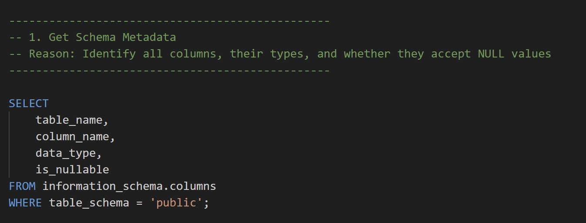
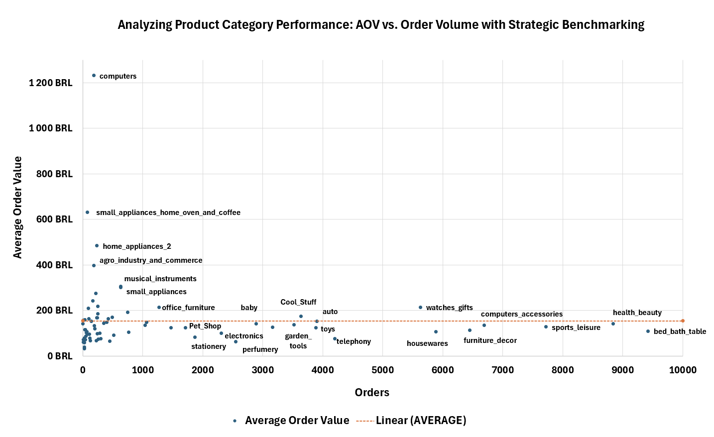

  

## I. Introduction

### **Who is Olist?**

Olist is a Brazilian e-commerce platform that connects small and medium-sized sellers to large online marketplaces, enabling them to sell their products across Brazil. It provides tools for order management, logistics, payments, and customer support, helping sellers reach more customers and scale their online business.

### **Project Goal**

The project aims to analyze Olist’s 2016–2018 data to identify key trends and patterns in revenue, orders, customer behavior, product categories, and seller performance. Insights from this analysis were used to provide actionable recommendations for growth, retention, and platform optimization.

### **Dataset**

[*https://www.kaggle.com/datasets/olistbr/brazilian-ecommerce?resource=download*](https://www.kaggle.com/datasets/olistbr/brazilian-ecommerce?resource=download)

### **Content of each dataset**

| **Dataset Name** | **Description** | **Business Context** |
| --- | --- | --- |
| **olist_customers_dataset** | Info about customers and their locations | Managing customer profiles and delivery destinations |
| **olist_geolocation_dataset** | ZIP codes with latitude, longitude, city, and state | Analyzing geographic distribution of orders and sellers |
| **olist_order_items_dataset** | Details of each item in an order | Tracking what products are sold by which sellers |
| **olist_order_payments_dataset** | Payment types, amounts, and installments | Analyzing payment methods and transaction data |
| **olist_order_reviews_dataset** | Customer feedback and ratings on orders | Measuring customer satisfaction and service quality |
| **olist_orders_dataset** | Summary info on each order (status, date) | Tracking order progress and buyer behavior |
| **olist_products_dataset** | Product details and categories | Managing product catalog and category analysis |
| **olist_sellers_dataset** | Seller info and location | Managing seller profiles and marketplace activity |
| **product_category_name_translation** | Translations of product categories from Portuguese to English | Making product categories understandable for analysis |

### **Tools used**

- PostgreSQL for data extraction and manipulation
- Excel pivot tables for detailed analysis
- Looker Studio for dashboards and visualizations

## II. Data Exploration

STEP 1 – Identify All Tables in the Dataset
 

**Objective:** Understand the overall dataset structure and the tables it contains.

- Listed all tables in the database (excluding system tables).  
- Verified table names, types, and schema.

**Key insight:**

The dataset contains the following main tables:

`olist_customers`, `olist_geolocation`, `olist_order_items`, `olist_order_payments`, `olist_order_reviews`, `olist_orders`, `olist_products`, `olist_sellers`, `olist_product_category_name_translation`.

This step ensures a clear overview of the dataset before performing deeper analysis.

**SQL Code:**

  

STEP 2 – Explore Individual Tables
 

**Objective:** Explore each table to understand its structure, size, and sample content.

**Actions performed:**

- Previewed the first 10 records of each table to inspect columns and values.  
- Counted total rows to understand table sizes.  
- Counted total columns using `information_schema.columns` to get schema information.

**Observations:**

- The row counts vary significantly between tables (some tables like `olist_orders` and `olist_order_items` are large).  
- Schema is consistent; columns are as expected.  
- No obvious structural issues were found at this stage.  
- Some columns representing dates or timestamps are stored as `TEXT` and may need conversion in later steps.

**Sample SQL Code :**

  

STEP 3 – Define Primary and Foreign Keys
 

**Objective:** Ensure data integrity by identifying primary keys (PK) and foreign keys (FK) for the dataset.

**A- Primary Keys Identified:**

| Table | Primary Key | Notes |
| --- | --- | --- |
| `olist_customers` | `customer_id` | Uniquely identifies each customer. |
| `olist_orders` | `order_id` | Uniquely identifies each order. |
| `olist_products` | `product_id` | Uniquely identifies each product. |
| `olist_sellers` | `seller_id` | Uniquely identifies each seller |

**SQL code :**

  

**Tables without natural PKs:**

- `olist_geolocation`: No single column uniquely identifies a row; multiple rows can share the same zip code, city, state, latitude, or longitude. A composite key or generated ID could enforce uniqueness.  
- `olist_order_items`: Neither `order_id` nor `order_item_id` alone is unique, but their combination is unique. A composite PK could be created if necessary.  
- `olist_order_payments`: No unique identifier exists; a PK isn’t strictly required for analysis.  
- `olist_order_reviews`: Neither `review_id` nor `order_id` alone is unique, but the combination is unique. A composite PK could be used if needed.

**B- Foreign Keys Identified:**

| Table | Foreign Key | References | Description |
| --- | --- | --- | --- |
| `olist_orders` | `customer_id` | `olist_customers.customer_id` | Links each order to the customer who placed it. |
| `olist_order_items` | `order_id` | `olist_orders.order_id` | Associates items with their corresponding orders. |
| `olist_order_items` | `product_id` | `olist_products.product_id` | Identifies the product being sold in each order item. |
| `olist_order_items` | `seller_id` | `olist_sellers.seller_id` | Identifies the seller responsible for each order item. |
| `olist_order_payments` | `order_id` | `olist_orders.order_id` | Links payments to the corresponding order. |
| `olist_order_reviews` | `order_id` | `olist_orders.order_id` | Associates each review with the order it references. |

**SQL code:**

  

STEP 4 – Identify Relationships Between Tables
 

**Objective:** Detect logical relationships and dependencies to support future JOIN operations.

**Relationships observed:**

- Customers → Orders → Order Items → Products/Sellers → Payments & Reviews

  

  

  

**Note:**

- These relationships were implemented as foreign keys in STEP 3.  
- Understanding these connections is critical for accurate analytics and relational queries.

STEP 5 – Identify Columns, Their Characteristics, and Data Quality Observations
 

**Objective:** Examine columns for data types, lengths, and potential issues.

**Key checks and observations:**

1. **Data types**: Some columns storing dates are `TEXT` instead of `TIMESTAMP`.  
2. **Numeric columns**: Lengths, quantities, or counts are sometimes stored as `DOUBLE PRECISION`; converting to `INT` is recommended.  
3. **ZIP codes**: Stored as `BIGINT`, better as `TEXT` to preserve formatting and leading zeros.  
4. **Column names**: Typographical errors found (e.g., `lenght` should be `length`).

These observations will guide data cleaning and type conversion in later steps.

   

   

   

  

STEP 6 – Identify Missing or Inconsistent Values
 

**Objective:** Ensure data quality by detecting missing values, duplicates, outliers, and timestamp inconsistencies across all tables.

A. Missing Values Analysis
 

We systematically checked each table for NULL or missing values:

- **olist_customers:** No missing values found.  
- **olist_geolocation:** No missing values found.  
- **olist_order_items:** All columns complete; no missing values.  
- **olist_order_payments:** All columns complete; no missing values.  
- **olist_order_reviews:**  
    - `review_comment_title`: 84% missing  
    - `review_comment_message`: 59% missing  
    - `review_score`, `review_creation_date`, and `review_answer_timestamp` mostly populated.  

> These missing comment fields are retained because the review scores are still valid for analysis.

- **olist_orders:**  
    - `order_approved_at`: 0.16% missing, corresponding to cancelled orders.

> Rows are retained to preserve complete order lifecycle information.

- **olist_products:**  
    - ~1.85% of rows have missing values in some columns (`product_category_name`, dimensions, weight).

> These rows are kept because they are referenced by orders in olist_order_items; removing them would break relational integrity.

- **olist_product_category_name_translation:** No missing values found.  
- **olist_sellers:** No missing values found.

B. Duplicate Detection
 

We checked for logical duplicates across tables:

- **olist_customers:** Multiple `customer_id` may share the same `customer_unique_id`.

> customer_unique_id represents the actual unique client; for analysis, this is the reference.

- **olist_geolocation:** Identical `(lat, lng, city, state, zip_code_prefix)` rows exist.

> Keep a single row per zip_code_prefix to reduce redundancy.

- **olist_order_items:** No duplicates found for `(order_id, order_item_id)`.  
- **olist_order_payments:** No duplicates found for repeated payments.  
- **olist_order_reviews:**  
    - Some `order_id` have multiple reviews.  
    - Suggested handling:  
        1. 1 `review_id` = 1 `order_id`: keep as-is.  
        2. 1 `review_id` linked to multiple `order_id`: generate new IDs for each pair (e.g., `review_id-1`, `review_id-2`).  
        3. Multiple `review_id` for 1 `order_id`: keep the earliest review, discard others.

- **olist_orders:** No duplicate orders found.  
- **olist_products:** Products with identical characteristics but different `product_id`.

> Only deletable if they are not linked to any order.

- **olist_product_category_name_translation:** No duplicates found.  
- **olist_sellers:** No duplicates found.

C. Outlier and Inconsistency Checks
 

- **Numeric columns:** Checked for negative values and unreasonable ranges.  
    - `price`, `freight_value`, `payment_value`: all ≥ 0  
    - `product_weight_g`, `product_length_cm`, `product_height_cm`, `product_width_cm`: all ≥ 0  
    - `product_name_length`, `product_description_length`, `product_photos_qty`: reasonable ranges  
    - `payment_installments` and `payment_sequential`: ≥ 0

D. Timestamp and Chronological Consistency
 

- **Orders:** Ensured logical date sequence:  
    - `order_approved_at` ≥ `order_purchase_timestamp`  
    - `order_delivered_carrier_date` ≥ `order_approved_at`  
    - `order_delivered_customer_date` ≥ `order_delivered_carrier_date`  
    - `order_estimated_delivery_date` ≥ `order_purchase_timestamp`

- **Order items:** `shipping_limit_date` ≥ `order_purchase_timestamp`.  
- **Reviews:**  
    - `review_creation_date` ≥ `order_purchase_timestamp`  
    - `review_answer_timestamp` ≥ `review_creation_date` (if present)

> All anomalies are flagged; rows with inconsistencies can be corrected or excluded if needed.

E. Column Type and Naming Considerations
 

- Date columns stored as TEXT should be converted to TIMESTAMP for efficient temporal operations.  
- Numeric columns representing counts (e.g., dimensions, weights) should use INT instead of DOUBLE to optimize performance.  
- ZIP codes stored as BIGINT may lose leading zeros; convert to TEXT.  
- Correct typos in column names (e.g., `product_name_lenght` → `product_name_length`).

**Outcome**

Step 6 confirmed:

- Certain missing values are acceptable due to relational dependencies.  
- Duplicate and inconsistent entries were identified, and strategies were proposed for review IDs and products.  
- No critical outliers found in numeric or timestamp fields.  
- Data types and column naming issues noted for further preprocessing.

> This step ensures that the dataset is clean, consistent, and ready for analysis while maintaining relational integrity.

  

---

**With the dataset explored, key relationships mapped, and missing or inconsistent values identified, we are ready to proceed with data cleaning, followed by exploratory data analysis to uncover insights.**

## III. Data Cleaning

**This step fixes data types, handles missing values, removes duplicates, standardizes text, and flags inconsistencies so we can analyze the data safely.**

STEP 1 – Correcting Data Types
 

**Purpose:** Make sure columns have the right type for calculations and analysis.

**Actions:**

- Convert TEXT → TIMESTAMP for date/time columns.  
- Fix spelling mistakes in column names (e.g., `product_name_lenght` → `product_name_length`).  
- Convert numeric columns from float → INT where needed.  
- Change postal codes from BIGINT → TEXT to keep leading zeros.

**Tables:** `olist_orders`, `olist_order_items`, `olist_order_reviews`, `olist_products`, `olist_customers`, `olist_sellers`, `olist_geolocation`.

**Outcome:** Columns now have the right type, so calculations and date operations work correctly.

**SQL Code Sample :** 

  

STEP 2 – Handling Missing Values
 

**Purpose:** Deal with missing data without breaking relationships or adding bias.

**Actions:**

- `olist_order_reviews`: Keep NULLs in comments to reflect real customer behavior.  
- `olist_orders`: Keep NULLs in `order_approved_at` for cancelled orders.  
- `olist_products`: Replace NULL product categories with `'unknown_category'`.  
- `olist_product_category_name_translation`: Replace NULL English category names with `'unknown_category'`.  
- `olist_products`: Replace NULL `product_photos_qty` with 0 to avoid calculation errors.

**Tables:** `olist_products`, `olist_order_reviews`, `olist_orders`, `olist_product_category_name_translation`.

**Outcome:** Missing values are handled carefully, keeping the dataset reliable for analysis.

**SQL Code Sample:**

  

STEP 3 – Duplicate Management
 

**Purpose:** Remove or manage duplicates to avoid errors while keeping data consistent.

**Actions:**

- `olist_customers`: Do not delete; use `customer_unique_id` as the unique identifier.  
- `olist_geolocation`: Keep only one row per (`lat`, `lng`, `zip_code_prefix`, `city`, `state`) to remove redundant locations.  
- `olist_order_reviews`:  
    - Create unique review IDs when a review is linked to multiple orders.  
    - Keep only the earliest review per order.  
- `olist_products` & `olist_order_items`: Check products not used in orders; do not delete any since all are referenced.

**Tables:** `olist_customers`, `olist_geolocation`, `olist_order_reviews`, `olist_products`, `olist_order_items`.

**Outcome:** Duplicates are managed properly, preventing double counting and keeping data consistent.

**SQL Code Sample:** 

  

STEP 4 – Handling Outliers and Data Inconsistencies
 

**Purpose:** Find and fix or flag values that don’t make sense.

**Actions:**

- `olist_orders`: Add a `data_quality_flag` to flag impossible date sequences (e.g., carrier delivery before approval).  
- `olist_order_reviews`: Flag reviews created before the order date.  
- `olist_products` & `olist_product_category_name_translation`: Standardize English product categories and replace missing values with `'unknown_category'`.  
- `olist_geolocation`:  
    - Standardize city names by removing accents, special characters, and fixing known mistakes.  
    - Remove extra characters and fix encoding issues.

**Tables:** `olist_orders`, `olist_order_reviews`, `olist_products`, `olist_product_category_name_translation`, `olist_geolocation`.

**Outcome:** Dataset is now consistent, standardized, and ready for exploratory data analysis (EDA).

**SQL Code Sample:** 

  

---

**After fixing types, handling missing values, removing duplicates, and standardizing data, the Olist dataset is clean and structured. All major quality issues are resolved, making it ready for the next step the Exploratory Data Analysis to discover trends, relationships, and insights.**

---   
### Revenue Analysis

**Question 1:** What is the total revenue generated by Olist between August 2017 and August 2018, considering partial data availability for 2018? How does this revenue evolve month by month over this period, and what are the key trends in sales volume, average price per product, and seasonality?

  
  

**Objective** The goal of this analysis was to understand how the company’s revenue evolved month-over-month from **January 2017 to August 2018**, and **identify key patterns** in **sales performance, pricing trends**, and **seasonality**.

**Key Insights** 

- Growth is volume-driven, with a **7.8x increase in units sold** (from 913 to 7,142) and a **7.5x increase in revenue** (from 111,798.36 to 838,576.64). This close alignment between units sold and revenue indicates that growth has been primarily driven by **customer acquisition rather than pricing strategy**.
- **Pricing stability** : The Average price held steady at ~120 BRL throughout 20-month growth period which indicates consistent product mix rather than product_category expansion
- **Seasonal revenue concentration**: November 2017 peak (988K BRL) represents 18% of entire 2017 revenue in just one month. This creates high business risk due to over-dependency - if this month underperforms, it could be catastrophic for annual results

  

**Objective** Track quarterly revenue progression and identify growth patterns and potential business risks**.**

**Key Insights** 

- **Strong business scaling**: Revenue grew 4**x from 705K to 2.8M BRL** over 5 complete quarters, demonstrating marketplace growth and customer acquisition during this analysis period.
- **Growth momentum shift**: Quarterly growth rate decelerated from **77% (Q1-Q2 2017) to 4% (Q1-Q2 2018)**, indicating the business is transitioning **from a phase of rapid acceleration to a more stable and steady growth stage**.

⚠️ **Note**: Q3 2018 includes only partial data (up to August), so it’s excluded from growth rate comparisons to avoid misleading conclusions.

### Orders x Seasonability x Growth **Analysis** - Question 2 **How many orders were placed on Olist between August 2016 and August 2018? What are the monthly trends in order volume, how fast is it growing, and what seasonal patterns can be observed during this period?** 
 

  

**Objective** Analyze and compare the seasonal patterns of monthly order volumes and monthly revenues over the period January 2017 to August 2018. This helps identify peak sales periods, potential risks due to seasonality, and whether revenue growth is driven mainly by order volume or other factors like pricing.

**Key Insights** 

Analyze monthly order volumes and revenues from January 2017 to August 2018 to identify seasonal patterns, growth dynamics, and business risks associated with sales fluctuations.

**Key Insights:**

- **Low seasonal activity in early 2017:**
    
    The first quarter shows seasonal indices ranging from 0.2 to 0.7, indicating a typical slow sales period.
    
- **Strong seasonal peak from October to December 2017:**
    
    Revenue indices exceed order indices slightly, suggesting price or product mix effects during this period, driven by key commercial events:
    
    - *October:* Children’s Day and Teachers’ Day boost sales of higher-value categories like toys and books.
    - *November:* Black Friday and Singles’ Day trigger the highest sales surge, reflecting heavy discounting and broad product range purchases.
    - *December:* Christmas and New Year’s preparations elevate demand, especially for gifts and seasonal goods, pushing revenue above order volume.
- **Close alignment between order and revenue seasonality:**
    
    For most months, revenue and order indices differ by no more than 0.05–0.1, confirming revenue growth is primarily volume-driven, rather than due to pricing or product mix changes.
    
- **More consistent seasonality in 2018:**
    
    Seasonal indices stabilize around 1 (range 0.91 to 1.12), indicating less monthly fluctuation and a maturation towards steady sales patterns.

The **seasonal index** is calculated as:

Orders in a given month ÷ Average monthly orders for that year

- Index = 1.0 → Average month → This month is **"typical"** — matches the yearly average.
- Index > 1.0  ( high season ) → Above average This month had **more orders / higher revenue than average**
- Index < 1.0 ( low season ) → Below average → This month had **fewer orders / lower revenue than average**

  

**Objective**

To track monthly order volumes and growth rates from January 2017 to August 2018, identify growth patterns, seasonal trends, and market corrections.

**Key Insights** 

- In early 2017, monthly growth rates experienced significant spikes, reaching +122.5% in February and +50.7% in March, reflecting rapid customer acquisition and accelerated sales growth.
- Negative growth months typically followed peak months, showing regular market corrections where demand slows after sharp expansions (e.g., March +50.7% followed by April -10.4%; May +53.9% followed by June -12.3%; November +62.9% followed by December -24.8%; January 2018 +28.1% followed by February +7.4%).
- Throughout 2018, growth rates stabilized, fluctuating moderately between approximately -10% and +7%, indicating a transition from the prior period of aggressive growth toward steadier, sustainable development.

### Products_Categories Analysis - Question 3 
**What are the top-performing product categories on Olist in terms of revenue between 2016 and 2018? How much does each category contribute to total revenue, and how do the top 10 categories evolve between 2017 and 2018?** 
 

  

**Objective** Identify the highest-performing product categories by comparing total revenue and quantity sold, helping to understand which categories drive sales volume and which generate the most revenue.

**Key Insights** 

   **Balanced Diversification**

- No single category exceeds 11% of total sales, so if one category declines, the overall business impact remains limited
- Diversification helps reduce commercial risks and supports stable growth
- The company avoids dependency on a single product type that could jeopardize revenue

   **Two Complementary Business Models**

- Some categories focus on volume with low margins (bed_bath_table, furniture_decor)
- Others prioritize profitability with high prices and lower volume (watches_gifts, health_beauty)
- This combination offers both stability **and** profitability depending on market conditions

   **Multi-Segment Monetization**

- The company effectively monetizes many niches rather than relying on a few star products
- Each small category contributes to overall revenue without creating major risk
- This approach maximizes revenue opportunities across the entire catalog

   **Business Model Resilience**

- During a recession, essential products (housewares 732K BRL, health_beauty 1.26M BRL) sustain baseline sales
- In periods of growth, pleasure and premium products (watches_gifts 1.20M BRL for only 6,594 units) generate high profits

  

**Objective** To analyze which product categories experienced the fastest revenue growth or decline between 2017 and 2018, highlighting emerging opportunities and potential risks in the product portfolio.

**Key Insights** 

   **Extreme Performance Gap**

- Small appliances shows massive opportunity with +4627% growth indicating an untapped market with huge potential
- The bottom 10 categories represent obsolete product segments that are declining rapidly and consistently
- Some product categories should be let go of completely so resources can be invested in other growing categories

   **Strategic Implications**

- Resource reallocation is needed to shift budgets from declining categories to growth winners
- Market timing is critical as small appliances is still in early growth phase so we should invest now

  

**Objective**  Assess changes in revenue concentration by examining which product categories accounted for 80% of total revenue in 2017 compared to 2018, including the **change in each category’s share of revenue**. This helps reveal shifts in core revenue drivers and identify categories gaining or losing importance over time.

**Key Insights** 

- Health beauty and watches gifts are losing significant market share (-2.63% and -1.59%) despite being top revenue contributors
- Cool stuff emerges as the biggest winner with +3.14% share gain, capturing market from other established top categories
- Mid-tier categories like garden tools (+1.46%) and perfumery (+1.08%) are successfully gaining influence within the portfolio
- Revenue redistribution occurs between existing established categories rather than toward completely new market segments

These values show how much the **revenue share per category increased or decreased in percentage points** between 2017 and 2018.

- **Positive values** indicate growth in revenue share.
- **Negative values** indicate a decline in revenue share.

### Payment Method Analysis - Question 4 **What are the most commonly used payment methods on Olist between 2016 and 2018? How does each method contribute to the overall usage share, and how do they differ in terms of average spending, installment frequency usage behavior?** 
 

  

  

**Objective** Understand how customers’ payment preferences have evolved between 2017 and 2018 to identify usage trends and assess potential revenue implications.

**Key Insights** 

- Credit card remained the most used payment method, with its share increasing from 73% in 2017 to 75% in 2018.
  
  This slight growth confirms its dominant position and aligns with its status as the method generating the highest average spending per order (163 BRL).

- Boleto experienced a slight decline in usage, dropping from 20% in 2017 to 18% in 2018.
  
  Despite this decrease, it maintained a strong average order value of 145 BRL, indicating it is still used by customers with significant purchasing capacity.

- Voucher usage declined from 6.4% in 2017 to 4.9% in 2018, making it the least popular method. It also generated the lowest average order value (66 BRL), suggesting it is mostly used for low-value or promotional purchases.

- Debit card saw the fastest growth among all payment methods, increasing from 0.9% to 2.0% between 2017 and 2018. With an average order value of 143 BRL, its growing adoption may reflect an expanding customer base of younger or newly banked users.

### Customer **Analysis** - Question 5 
**What is the distribution of customers across loyalty segments (New, Occasional, Loyal, Very Loyal), and how does each segment's representation in our customer base compare to their individual spending power and total revenue contribution? What does this analysis reveal about our customer retention efficiency and untapped revenue potential?**
 
 

  

  

**Objective** 

To visualize the distribution of customers across different segments (e.g., New, Engaged, Loyal, Very Loyal) and identify imbalances or gaps in the customer base.

**Key Insights** 

- 97% of customers are new and make only one purchase, which shows the company is struggling to retain customers.
- Only 0.05% of the customer base is considered loyal, highlighting a major issue with customer retention and engagement.
- Loyal customers spend five to six times more than new customers, but they are too few to make a significant impact on total revenue.
- The company relies heavily on acquiring new customers rather than developing long-term relationships, which is not a sustainable growth strategy.
- Most customers are not progressing from new to loyal stages, indicating that the customer journey is not effective.
- Very loyal customers, who spend an average of 993 BRL, represent only 0.010% of all customers, showing a large untapped opportunity to increase customer lifetime value.

### Average_Order_Value Analysis - Question 6 
**How have monthly Average Order Values (AOV) evolved from 2017 to 2018—including Q4 forecasts—and how do product categories and geographic regions vary in AOV and order volume? What insights can be drawn about revenue concentration, seasonal risks, and the growth potential of strategically positioned categories and states?** 

  

**Objective** 

Analyze monthly trends in **Average Order Value (AOV)** from **January 2017 to September 2018**, and interpret the **forecasted values for Q4 2018**, in order to identify spending patterns, seasonal behaviors

**Key Insights** 

- The average order value fluctuated significantly between January 2017 and September 2018, with a peak of **239 BRL in Sep 2017** and a low of **166 BRL in Sep 2018**, showing no consistent seasonal pattern.
- From March to July 2018, the AOV remained relatively stable between **205 and 220 BRL**, indicating a steady customer purchasing behavior during mid-year.
- A sharp decline occurred from **July to September 2018**, dropping nearly **50 BRL**, but the forecast for Q4 2018 suggests a strong rebound, reaching **237 BRL in December**, close to the 2017 peak.
- Historical data shows that AOV often increases toward the end of the year, suggesting the impact of seasonal promotions or holiday shopping.
- The months of **June and July** tend to have lower AOVs both in 2017 and 2018, possibly reflecting a seasonal dip in customer spending.

  

**Objective**  

These visualizations aim to analyze the performance of product categories on the Olist platform by combining two key indicators:

- **AOV (Average Order Value) —> ~206 BRL**
- **Order Volume**

The objective is to identify **strategic opportunities**: high-potential products (either high value or high volume), **profitable niches**, and **underperforming categories**.

**Key Insights** 

- **Low AOV, High Volume Categories**
    
    Categories like *bed_bath_table*, *health_beauty*, and *sports_leisure* have **high order volumes but low AOV**, indicating **mass-market appeal**. These are ideal for **price-driven campaigns** and **high-volume promotions**.
    
- **High AOV, Low Volume Niches**
    
    Categories such as *computers*, *small_appliances_home_oven_and_coffee*, and *home_appliances_2* show **high AOV but low order volumes**, suggesting **premium or niche positioning**. These segments are better suited for **targeted campaigns** focused on **value and personalization**.
    
- **Majority Below AOV Average**
    
    Most categories fall **below the average AOV line**, pointing to a **large share of lower-priced products**, which can drive traffic but require high volume to sustain revenue.
    
- **Strategic Segmentation**
    
    The volume vs. value chart helps **identify product mix components** and tailor **category-specific marketing strategies** — focusing either on **scaling sales or maximizing value** per transaction.

  

**Objective** 

The second chart zooms in on the central area of the previous visualization, focusing on categories around the **average AOV (~250 BRL)** and **moderate order volumes (up to 800 orders)**.

Its purpose is to provide a **clearer view of intermediate product categories**, where most of Olist's sales activity is concentrated.

**Key Insights** 

- **Home appliances** (80 orders, 115 BRL), **Home comfort** (50 orders, 30 BRL), and **Food** (450 orders, 35 BRL) illustrate the "low price ≠ high volume" paradox, where aggressive pricing strategies fail to generate significant order volume, proving customers are not price-sensitive in these segments.
- **Luggage accessories** (250 orders, 185 BRL), **Industry commerce** (500 orders, 170 BRL), and **Kitchen & construction tools safety** (≈200 orders, 165-170 BRL) represent the best performers in this segment, approaching but still falling short of the 206 BRL platform average while maintaining decent order volumes.
- **Audio** (30 orders, 85 BRL), **Fixed telephony** (120 orders, 75 BRL), and **Drinks** (80 orders, 55 BRL) fall into the dead zone with neither volume nor value, accumulating poor performance on both axes while consuming resources without visible returns.

  

**Objective** 

To analyze Olist's geographic performance across Brazilian states by comparing order volume and average order value to identify regional market characteristics and performance disparities.

**Key Insights** 

- **SP, MG, PR, RJ** (**≈**70k-**≈**2k orders) underperform with AOV below national average (190-167 BRL vs 206 BRL) despite massive volumes, revealing a price-sensitive mass market that drags down overall profitability in major economic metropolises.
- **DF, PB, AM** (569-3 orders) significantly outperform with premium AOV (647-420 BRL vs 206 BRL average) despite low volumes, confirming established luxury customer segments that drive up platform value per transaction.
- **MA, ES, GO** (406-463 orders) represent the "trap zone" with medium volumes but far below average AOV (133 BRL vd 206 BRL), indicating price-sensitive developing markets that struggle

**Extreme geographic concentration:** SP alone concentrates over 70k orders (≈70% of total), revealing **hyper-dependence** on the São Paulo market.

**Premium customer segments:** States with low volume but high AOV (DF, PB, AM) represent **confirmed luxury niches** with established premium customer profiles.

**Market limitations:** Northern/Northeastern states show minimal volumes, revealing **logistical constraints** or limited e-commerce adoption.

### Sellers and Geography Analysis - Question 7 **Who are the sellers on Olist with the lowest performance in terms of revenue and number of orders between 2016 and 2018? Are these low-performing sellers recently onboarded, and what products do they sell? Can negative customer reviews or specific product categories explain their poor performance?** 
 

While many analyses of the Olist dataset focus on order volume or product categories, I chose to prioritize the sellers, who are Olist’s direct business customers. Understanding who they are, why some succeed, and why others fail is critical to Olist's long-term growth. This deep dive allowed me to identify key strategic behaviors among top sellers and recurring issues among underperformers — offering actionable insights for platform improvement.

### ** "Why Seller Performance Matters to Olist"**

### **1. Market Landscape**: Geographic distribution + seller overview

  

****

**Objective** **:**

Analyze the distribution of Olist sellers across Brazil’s five regions to identify performance patterns, market saturation, and expansion opportunities.

**Key Insights**

1. Heavy Dependence on Southeast Poses RiskThe Southeast region hosts 76% of all sellers and generates 78% of total revenue (R$10.6M), indicating a high concentration in a single geographic area. This over-reliance makes Olist vulnerable to localized economic downturns or increased competition in the region.
2. Northeast Leads in EfficiencyDespite hosting fewer sellers, states like Maranhão (13.5), Bahia (4.67), and Pernambuco (2.59) outperform significantly on efficiency metrics. This suggests that in underpenetrated markets, sellers can generate much higher returns due to lower competition and greater visibility.
3. South Region Shows Saturation SignsThe South — while strong in seller volume (e.g., Paraná with 653 sellers) — is starting to show signs of diminishing returns. The region's efficiency ratio of 0.93 indicates that an increase in sellers does not translate to proportionate revenue, suggesting market saturation.
4. Clear Expansion Opportunities in the NortheastWhile São Paulo, the largest market (4,131 sellers), achieves only slightly above-average efficiency (1.03), states in the Northeast with fewer than 30 sellers are generating 2–13x the average performance. This highlights untapped opportunities for strategic growth in these emerging markets.

### Performance Highlights:

**Top Performers**

- Maranhão: 13.5 ratio; R$36.4K per seller (17.7× platform avg)
- Bahia: 4.67 ratio; R$9.5K per seller (4.6× avg)
- Pernambuco: 2.59 ratio; R$5K per seller (2.4× avg)

**Bottom Performers**

- Acre: R$267 total revenue; 0.10 efficiency
- Amazonas: R$1,177; 0.50 efficiency
- Pará: R$1,238; 0.50 efficiency

### **2.Seller Segmentation**

  

**Objective**

This graph provides an overview of all product categories segmented by their market characteristics - showing which are oversaturated (Red Ocean), underexploited opportunities (Hidden Gems), balanced growth markets (Emerging Opportunities), or low-demand niches to avoid.

**Key Insights**

1. **Red Ocean Domination** The marketplace is dominated by Red Ocean categories like furniture_decor, housewares, auto, and toys. These categories concentrate the majority of sellers but generate low average revenues due to intense competition that drives prices down and fragments demand.
2. **Inverse Competition-Profitability Relationship** The more sellers, the lower the average revenue due to demand dilution: auto has 400 sellers for only 1,000 BRL/seller while housewares reaches 450 sellers for 2,000 BRL/seller. This difference is explained by naturally higher margins in housewares (home articles) versus auto (standardized parts). The exception is health_beauty which maintains over 5,000 BRL despite 500+ sellers thanks to diversified segmentation (premium cosmetics, supplements, specialized care).
3. **Neglected Hidden Gems** Categories like computers generate over 25,000 BRL per seller with very few competitors, and watches_gifts offers 12,000 BRL for about 100 sellers only. This potential remains underexploited probably due to lack of platform visibility.
4. **Low-Yield Niches Without Opportunity** Categories like fashion_shoes, audio, and kitchen combine few sellers AND low revenues, revealing insufficient demand that makes them non-viable.
5. **Heterogeneous Red Oceans** In furniture_decor and housewares, averages are pulled down by the coexistence of high-rotation products (basic chairs, common utensils) with seasonal products (Christmas decorations) or marginal ones (custom furniture) with variable performance.
6. **Emerging Opportunities** Sports_leisure and computers_accessories present optimal balance with moderate competition (200-300 sellers) and decent revenues (3,000-6,000 BRL). These categories therefore offer profitable growth potential before reaching saturation and shifting into Red Ocean territory.

### **3.Performance Analysis**

**Goal:** What makes a seller top-performing?

  

**Objective**

Understand how many product categories sellers typically operate in 

**Key Insights**

Seller behavior shows a clear preference for specialization - over half focus on just one category, with participation dropping sharply as complexity increases. This suggests most sellers on Olist are small, specialized businesses rather than large retailers. 

1. There's a massive 59% drop-off when sellers try to expand from 1 to 2 categories (1,689→690), making this the biggest barrier sellers face on the platform.
2. Every expansion step remains challenging with significant drops ranging from 37% to 57%, but the difficulty varies rather than following a consistent pattern.
3. Only 282 sellers (9%) successfully operate across 5+ categories, suggesting this requires either substantial resources or platform mastery that most sellers haven't achieved.

Most sellers enter Olist as specialists and struggle to diversify. There may be hidden operational challenges like inventory management, supplier relationships, or marketing complexity that make expansion difficult.

  

**Objective**

To analyze the market positioning strategies of top-performing sellers across different diversification levels (Specialized, Semi-diversified, Diversified) and understand how they allocate their revenue across different competition levels (Hidden Gem, Emerging Opportunity, Red Ocean, Low-Yield Niche) to identify successful patterns.

**Key Insights**

Most successful sellers avoid high-competition Red Ocean categories, with only one seller achieving significant success there by operating across 10 different categories, demonstrating that competing in saturated markets requires massive operational scale. Several top performers generate over 25% revenue from Emerging Opportunity categories, suggesting this could be an underexploited growth strategy for other sellers.

As expected , no top performer relies heavily on Low-Yield Niche categories, confirming these represent truly low-potential markets that should only serve as supplementary revenue streams. When sellers do choose to diversify, they maintain focus by keeping one dominant positioning strategy above 50% of revenue rather than spreading evenly across all market types. ((869f7a5dfa277a7dca6462dcf3b52b2: 87.6% Hidden Gem (dominant), 4a3ca9315b744ce9f8e9374361493884: 82.4% Hidden Gem (dominant), 7e93a43ef30c4f03f38b393420bc753a: 96.2% Hidden Gem (dominant), 955fee9216a65b617aa5c0531780ce60: 60.18% Red Ocean (dominant))

The data reveals a clear operational threshold - sellers managing fewer categories should focus on Hidden Gem strategies for reliability, while those with the capacity to handle 8+ categories can successfully explore Emerging Opportunities and even Red Ocean markets. This suggests that category management capability directly influences which market positioning strategies are viable for different sellers on the platform

### 4. Underperforming Sellers

  

**Objective**

**Highlight the pricing inefficiencies and poor market positioning of One-Time sellers** compared to regular sellers

**Key Insights**

One-Time sellers tend to overprice their products while positioning themselves in highly saturated “Red Ocean” categories — representing **22 out of 53** total categories, such as *home_appliances*, *electronics*, *air_conditioning*, *home_construction*, or *pet_shop* — or in low-yield markets like *arts_and_craftsmanship*, *fashion_female_clothing*, *diapers_and_hygiene*, or *furniture_bedroom*, which represent **11 out of 53** categories. This poor positioning makes their pricing strategy even less effective and reduces their chances of success.

In total, One-Time sellers charge higher prices than regular sellers in **35 out of 53 categories**, suggesting a widespread tendency to misalign with market expectations. Conversely, in the remaining **18 categories**, their prices are lower, which may reflect either underestimation of product value or desperate attempts to compete on price — both signaling a lack of coherent strategy and market understanding.

Unlike regular sellers who adapt their pricing to match demand and competition, One-Time sellers often act in isolation from market signals. This disconnect limits their performance and undermines any potential for repeat business or long-term growth.

In many categories, their prices show sudden and unjustified spikes, which suggest a lack of benchmarking or competitor analysis. For example, in the *computers* category, One-Time sellers charge on average over **5,100 BRL** compared to **1,058 BRL** for regular sellers — a difference of over **380%**. Similarly, in *watches_gifts*, prices are more than twice as high (**438 BRL** vs. **201 BRL**), which undermines customer trust and discourages purchase

  

**Objective**

This chart highlights the product categories where sellers most often fail, revealing how market saturation and poor positioning impact seller success

**Key Insights**

Many failed sellers concentrate in highly saturated Red Ocean categories such as furniture_decor, auto, housewares, baby, and construction_tools_construction — all in the top 10 failure list — highlighting how overcrowded markets can lead to fierce competition and low visibility for newcomers.

Emerging categories like health_beauty and sports_leisure also attract over 50 one-time sellers each, showing that even in growing segments, success is not guaranteed without proper pricing, differentiation, or product quality.

These patterns suggest that many sellers are choosing familiar or visible categories without a clear go-to-market strategy, leading to one-off sales and early exits.

## V. Recommendations

### **1. Revenue & Growth**

- Smooth monthly revenue by running smaller campaigns during low-season months to reduce dependency on November peaks.
- Focus on sustainable growth by exploring ways to increase repeat purchases rather than relying only on new customer acquisition.

### **2. Orders & Seasonality**

- Prepare targeted campaigns for Q4 peaks (Black Friday, holiday season) to maximize sales.
- Use promotions or incentives during low-season months to maintain more consistent order volumes.

### **3. Product Categories**

- Focus marketing efforts and increase visibility on the fastest-growing categories (such as small appliances and cool_stuff) to take advantage of their strong sales potential.
- Maintain a balanced product mix between high-volume/low-margin and low-volume/high-margin categories to protect overall profitability.

### **4. Payment Methods**

- Optimize credit card checkout and installment options to encourage higher spending per order.
- Encourage more customers, especially new or younger ones, to pay with debit cards, because this method is growing in use and already brings in a good amount of money per order (~143 BRL).

### **5. Customer Retention**

- Implement basic loyalty programs or first-purchase follow-ups to convert new customers into repeat buyers.
- Focus on engaging the small loyal and very loyal customer segments to maximize lifetime value.

### **6. Average Order Value & Geographic Insights**

- Focus campaigns on high-AOV states (DF, PB, AM) to maximize revenue per order.
- Test upselling or bundling strategies in high-volume but low-AOV states (SP, MG) to improve profitability.
- Consider exploring growth opportunities in low-volume but **not yet exploited** states to expand geographic reach.

### **7. Sellers & Marketplace**

- Expand seller acquisition in high-efficiency, underpenetrated states in the Northeast (e.g., Maranhão, Bahia).
- Provide pricing guidance and category recommendations to reduce overpricing and improve seller success.
- Encourage sellers to diversify carefully into Emerging Opportunity or Hidden Gem categories rather than Red Oceans or low-yield niches.

## VI. Limitations

- Some **missing values** remain in review comments and product details, which limits the depth of analysis on customer feedback and product characteristics.
- The dataset is **unevenly distributed** toward certain regions (like São Paulo) and customer segments (mostly new customers), which may bias trends and make it harder to generalize insights across all states or customer types.
- **Outliers and extreme values** in order amounts and AOV could influence averages, making some categories or sellers appear more or less profitable than they truly are.
- **Limited historical coverage:** Only 2017 has full-year data, while 2016 and 2018 are partial, which may affect trend analysis and seasonal pattern interpretations.
- **Seller-product distribution:** Many sellers operate only one product or category, which makes it harder to evaluate overall seller performance or compare strategies across multi-product sellers.
- **Data type and formatting issues** required cleaning, so some subtle errors or misclassifications could still exist, slightly affecting analysis accuracy.

## VII. Conclusion

This analysis of Olist’s data from 2016 to 2018 shows strong growth in revenue and orders, mainly driven by gaining new customers and popular product categories. Seasonal trends and differences across regions show chances for more balanced growth, while low customer retention and underperforming sellers highlight areas that need improvement. These insights can help Olist focus marketing efforts, make better decisions about which product categories to promote or optimize, and support sellers to maintain growth and increase profitability.

## VIII. Dashboard

